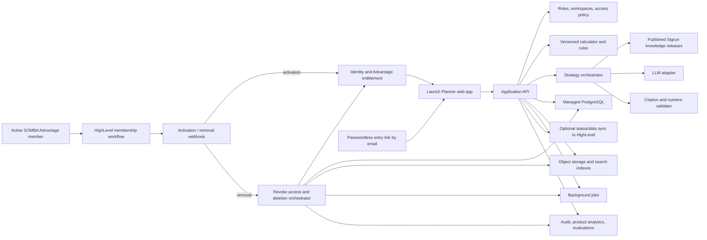

# Sigrun Launch & Sell Planner

## Business and technical scoping brief

**Status:** Discussion draft

**Date:** 8 August 2026

## 1. Executive recommendation

Build one independent, multi-tenant web application with its own identity and entitlement system. Use Somba/HighLevel for three narrower purposes:

1. **Eligibility:** active SOMBA Advantage membership—and only active Advantage membership—grants participant access to the Launch Planner.
2. **Provisioning:** a HighLevel workflow creates or updates the participant's account and entitlement in the new application.
3. **Discovery:** the entry link is communicated to eligible members by email only.

Commercially, bundle the initial product into the SOMBA Advantage membership. Technically, keep Somba as the membership and customer-lifecycle system rather than the Launch Planner's authentication or product-data store.

The first product should not be a generic chatbot. It should produce one high-value outcome:

> Turn a client's revenue goal and current business reality into a credible, Sigrun-approved launch plan with transparent assumptions, realistic scenarios, and clear next actions.

There are three non-negotiable product boundaries:

- The **calculator** performs all authoritative calculations with deterministic, versioned formulas.
- Sigrun's **approved methodology** determines which advice is available and when it applies.
- The **LLM** explains, organizes, and personalizes approved guidance; it does not invent formulas, browse the web, or introduce unsupported strategy.

Before building the software, run a short Phase 0 to make Sigrun's tacit judgment explicit and test it manually. The largest product risk is not engineering. It is discovering that different launch situations still require knowledge that has not yet been codified.

## 2. Product thesis

### Primary user

An active SOMBA Advantage member preparing to launch an offer.

### Secondary users

- **Coach:** reviews assumptions, corrects strategy, and approves the plan.
- **Sigrun/team administrator:** manages users, programs, methodology releases, and aggregate insights.
- **Later:** external coaching businesses or standalone Somba customers.

### Core jobs to be done

- Determine whether a revenue goal is credible.
- Translate the goal into required sales, registrations, attendance, conversations, audience, budget, and time.
- Choose the right launch approach for the client's offer, maturity, evidence, resources, and audience.
- Identify the assumptions most likely to break the plan.
- Arrive at coaching sessions with useful pre-work rather than a blank page.
- Revisit the plan later and compare forecast with actual performance.

### Value by stakeholder

| Stakeholder | Value |
|---|---|
| Client | Clarity, confidence, scenario comparison, and an executable plan without false precision |
| Coach | Standardized pre-work, faster diagnosis, fewer repeated calculations, and more time for judgment |
| Sigrun | Productized IP, consistent delivery, structured learning across launches, and a future software revenue stream |

## 3. Recommended commercial path

### Start B2B2C, not self-serve

The first buyer should be Sigrun's business and the first distribution channel should be the existing SOMBA Advantage membership. This creates immediate access to eligible members and coaches and a feedback loop that a standalone launch would lack. Advantage is a continuous membership, not a cohort-based program.

For Phase 1, use one commercial model only: **the Launch Planner is an included Advantage membership benefit with no separate participant charge**. Evaluate whether it improves Advantage engagement, retention, perceived value, client outcomes, and coach leverage.

Standalone subscriptions, licences for other coaching teams, and white-label editions remain possible later, but they are outside the initial product and entitlement model. No other Sigrun program receives access during this phase.

## 4. Phased roadmap

| Phase | Outcome | Included | Exit gate |
|---|---|---|---|
| **0. Codify and validate** | A testable version of Sigrun's method | Formula specification, decision tree, knowledge cards, prototype, 10–20 reconstructed launches, golden test cases | Sigrun and coaches reach materially consistent recommendations from the same inputs |
| **1. Plan** | A coach-approved launch plan | Passwordless authentication, Advantage-based provisioning, intake, deterministic calculator, scenarios, grounded strategy, citations, coach review, save/version/export while membership is active | At least 80% of pilot outputs are directionally approved and the workflow saves meaningful coach/client time |
| **2. Execute** | Clients run the launch from the plan | Timeline, milestones, tasks, templates, check-ins, actual-versus-plan, reforecasting, coach alerts | Users return weekly and execution data improves coaching decisions |
| **3. Connect** | Somba data improves planning and execution | Selected CRM/launch metrics, API connection, lifecycle events, and limited status write-back | Data integration reduces work or improves outcomes enough to justify maintenance |
| **4. Productize** | An optional external software business | Billing, multi-brand support, external coach licences, white-labeling, anonymized benchmarks | Pursued only if Sigrun later chooses to expand access beyond Advantage |

Sigrun approved starting the five-category historical validation pass in Slack reply `1786895999.683269` on 2026-08-16. No case data or expected outputs were supplied, so the immediate Phase 0 task is to collect and run those five cases before expanding toward the 10–20 reconstructed-launch set.

Sigrun later reported in Slack reply `1787329580.840629` that a June launch using a community converted at 0.69%, then directed Beginner to omit community in reply `1787329961.144849`. The June observation is incomplete historical evidence: without the underlying inputs, source artifact and approved outputs it does not make a golden case executable, change the deterministic conversion formula or pass the Phase 0 gate.

Sigrun confirmed in Slack reply `1786916169.808439` that the planner must retain EUR and support a broader international currency list for Advantage members across roughly 70 countries. Each plan uses one selected currency for all amounts. The calculator respects that currency’s smallest unit but performs no exchange-rate conversion; the source-defined €297 and €1,000 methodology rules remain EUR-only.

An indicative path for a small experienced team is 1–2 weeks for Phase 0, 4–8 weeks for the Phase 1 product, and a 2–4 week controlled pilot. This should be re-estimated after the formula and workflow audit.

## 5. Phase 1 product scope

### Main user journey

1. Active Advantage access in HighLevel provisions the member automatically. There is no participant-facing manual exception path for non-members.
2. The client creates a launch project and completes a guided intake.
3. The calculator validates the inputs and generates conservative, base, and stretch scenarios.
4. A rules engine selects the applicable parts of Sigrun's approved playbook.
5. The LLM assembles a structured, cited strategy using those materials and the calculated facts.
6. The client can change an assumption and see the plan recalculate.
7. The coach comments, edits, and approves the plan.
8. While Advantage membership remains active, the approved version can be shared or exported for execution.

### Suggested screens

- Home / active launches
- Guided launch intake
- Scenario calculator and sensitivity view
- Strategy and rationale
- Timeline and next actions
- Coach review and approval
- Plan history and export
- Admin: users, assignments, methodology, and knowledge releases

### Calculator inputs to confirm with Sigrun

- Offer, format, price, payment terms, refund/default assumptions
- Revenue, cash, profit, and client-count goals
- Existing audience/list and audience quality
- Historical opt-in, attendance, application, sales-call, and purchase conversion rates
- Organic versus paid acquisition mix, cost per lead, and available budget
- Launch dates, runway, and team capacity
- Proof level, prior-launch experience, offer maturity, and channel readiness

### Calculator outputs

- Required sales
- Required offer exposure, calls, attendees, registrations, leads, and estimated reach
- Paid lead requirement, acquisition cost, and budget where applicable
- Gross revenue, expected collected cash, variable cost, contribution, and margin
- Conservative, base, and stretch scenarios
- The assumptions with the greatest sensitivity
- Missing inputs and Sigrun-defined warning conditions

The exact funnel stages should follow Sigrun's actual launch archetypes. The engine should work backwards from the goal, retain every formula and assumption, and assign a `calculator_version` to every saved result.

### Strategy output

- Executive summary
- Assumptions and missing information
- Recommended launch approach and rationale
- Milestones and sequencing
- Channel/action plan
- KPIs linked to calculator results
- Risks, mitigations, and contingency triggers
- Decisions that still require the client or coach
- A source reference for every substantive recommendation

### Explicitly outside Phase 1

- Full CRM and marketing automation
- Email, ad, funnel, or social-content generation
- Generic open-ended AI chat
- Two-way HighLevel synchronization
- Comprehensive project management
- Self-serve billing and multiple white-label brands
- Automatic performance claims or guarantees
- A former-member portal, read-only archive, or post-membership export path

## 6. Constraining the AI to Sigrun's knowledge

A prompt alone cannot guarantee that a pretrained model uses only Sigrun's thinking. The strongest practical design is to make Sigrun's content and rules the **only allowed source of recommendations** and use the LLM mainly as a structured composer.

### Knowledge model

Break the methodology into small approved knowledge cards. Each card should contain:

- Stable ID and title
- Guidance and recommended action
- Trigger conditions
- Rationale
- Exceptions and contraindications
- Applicable launch type, stage, offer, audience, or maturity tags
- Original source and page/timestamp/interview note
- Draft, reviewed, published, or retired status
- Version, approver, and approval date

Sigrun or an explicitly delegated methodology owner approves each card. Published releases are immutable; a correction creates a new version. Every strategy records the exact knowledge release used.

### Generation controls

- Retrieve only published Sigrun knowledge.
- Disable web search and general external knowledge tools.
- Select eligible cards with deterministic rules and metadata before calling the LLM.
- Require structured output rather than unconstrained prose.
- Require a valid card citation for every recommendation.
- Reject citations that were not supplied to the model.
- Check every number against the calculator before showing the result.
- For unsupported situations, answer: “This is not covered by Sigrun's current playbook” and route it to a coach.
- Keep the calculator usable if the model is unavailable.

Do not fine-tune initially. Versioned rules and retrieval give better traceability and are easier to update. Fine-tuning may later help with voice or formatting, but it should not become the source of business truth.

### Evaluation set

Create 30–50 anonymized, Sigrun-approved cases covering normal situations, edge cases, missing data, and cases where the correct result is to abstain. Re-run this set whenever a formula, prompt, model, or knowledge release changes.

Measure:

- Exact formula and rounding correctness
- Correct methodology-card selection
- Numeric consistency
- Citation coverage and accuracy
- Appropriate abstention
- Coach rating and edit distance
- Prompt-injection resistance
- Cross-client data isolation
- Latency and cost per completed plan

## 7. Somba and HighLevel decision

### Confirmed user model

The target clients are active SOMBA Advantage members in `programs.sigrun.com`. In HighLevel terms they are contacts/client-portal learners, not generally agency or sub-account users. Membership is continuous rather than cohort-based, and no other program grants participant access.

That removes the main benefit of the earlier Marketplace Custom Page approach. HighLevel's signed Marketplace context applies to authenticated agency/location users. Its documented Client Portal magic links authenticate contacts into native child apps—Courses, Communities, and Affiliates—but do not provide general-purpose authentication into an arbitrary external SaaS. [HighLevel Client Portal magic links](https://help.gohighlevel.com/support/solutions/articles/155000001667/)

I found no documented way to add an arbitrary third-party application to participant-facing Client Portal navigation; HighLevel's own feature request for Client Portal custom menu links was still open in 2026. For the current design, **“integrated with programs.sigrun.com” should mean branded linking, synchronized access, and a shared customer lifecycle—not an iframe or shared browser session.** [HighLevel Client Portal custom-menu request](https://ideas.gohighlevel.com/client-portal/p/custom-menu-links-in-client-portal)

### Recommended integration pattern

Use the Launch Planner's own managed, passwordless authentication and let **active Advantage membership create the entitlement**.

1. A participant's Advantage membership becomes active in HighLevel.
2. A HighLevel workflow sends an authenticated outbound webhook to the Launch Planner.
3. The Launch Planner creates or updates the internal user, links the HighLevel contact identity, and grants the Advantage entitlement.
4. The Launch Planner sends its own branded email containing the one-time entry link.
5. No Launch Planner link is placed in the course, community, or Client Portal; entry is communicated by email only.
6. When Advantage membership ends, a second workflow immediately revokes the entitlement, invalidates active application sessions, and starts deletion.
7. The system permanently deletes the member's Launch Planner account data, projects, calculations, generated strategies, uploaded files, and stored exports.
8. If the person later rejoins Advantage, the Launch Planner provisions a new empty account experience; prior work cannot be restored.

HighLevel supports workflow triggers for New Signup, Offer/Product Access Granted and Removed, and Community Group Access Granted and Revoked. Its outbound webhook action can send contact and event data to an external application. [HighLevel workflow triggers](https://help.gohighlevel.com/support/solutions/articles/155000002292), [Offer Access Granted](https://help.gohighlevel.com/support/solutions/articles/155000003250-workflow-trigger-offer-access-granted), and [outbound webhooks](https://help.gohighlevel.com/support/solutions/articles/155000003299-workflow-action-webhook-outbound-) support this lifecycle.

The Launch Planner database—not HighLevel—should own authentication subjects, roles, client workspaces, projects, calculator runs, strategies, methodology releases, and audit history.

### Identity and entitlement mapping

Store these separately:

- Internal authentication subject and internal user ID
- Internal organization/client-workspace ID
- `highlevel_location_id`
- `highlevel_contact_id`
- The exact HighLevel identifier or status representing active Advantage membership
- Advantage entitlement, activation/end timestamps, and access state
- Provisioning-event ID for idempotency

Do not use email as the only external identity key. HighLevel can permit multiple contact or portal records with the same email, so the durable external mapping should be based on the location and contact IDs. Email remains the verified login and communication address. [HighLevel Client Portal user guide](https://help.gohighlevel.com/support/solutions/articles/155000000197-how-can-my-customers-use-the-client-portal-)

### User experience

| Entry route | Experience |
|---|---|
| Advantage access email | The Launch Planner sends a one-time passwordless invitation after provisioning |
| Subsequent access | The member follows the link previously communicated by email and signs in passwordlessly if the session has expired |
| programs.sigrun.com | No Launch Planner entry link is displayed in the portal, courses, or community |
| Coach/admin access | Staff use the same identity system with MFA and stronger roles |

This creates one additional authentication step the first time a participant enters the Launch Planner, but it avoids a fragile pseudo-SSO based on query parameters or email. After the initial login, a normal persistent session makes return visits low-friction.

### Confirmed membership policy

Sigrun reconfirmed in Slack reply `1786895999.683269` on 2026-08-16 that saving and export are available while Advantage membership is active, then access ends and the participant data is deleted when membership ends.

- **Eligible participants:** active Advantage members only. Other Sigrun program participants are ineligible.
- **Membership model:** continuous membership; there are no cohorts.
- **Activation:** access begins when Advantage membership becomes active in HighLevel.
- **Revocation:** access ends immediately when the member leaves Advantage or the corresponding HighLevel access is removed.
- **Deletion:** leaving Advantage permanently deletes the participant's Launch Planner data rather than placing it in an inactive or read-only state.
- **After leaving:** no sign-in, viewing, generation, sharing, export, or recovery capability; there is no former-member archive.
- **Rejoining:** a returning Advantage member starts fresh with no access to prior plans or strategies.
- **Entry channel:** the participant-facing entry link is communicated by email only.
- **Staff:** Sigrun's administrators and coaches use separate staff roles and are not governed by the member-entitlement rule.

Authorization must check the current Advantage entitlement on every protected request, not only at login. Revocation should immediately invalidate active sessions, cancel queued generation jobs, and invalidate temporary download links. A deletion job must then purge the member's records and files from the primary database, object storage, search/vector indexes, caches, analytics profiles, and other processors. Export creation and download must both require an active entitlement.

The implementation must define and verify a deletion completion SLA and ensure that backup expiry and third-party processor deletion are consistent with the no-retention policy.

### Integration sequence

1. **Phase 1:** one Advantage-activation webhook, one Advantage-removal webhook, passwordless invitations by email, entitlement checks on all protected actions, and a verified hard-deletion workflow.
2. **Pilot hardening:** retry and reconciliation jobs, staff-only membership resynchronization, duplicate-contact handling, and a daily exception report. Staff cannot use the admin interface to grant participant access without an active Advantage membership.
3. **Phase 1.5:** if useful, use a narrowly scoped private integration for this Sigrun location to write plan status or milestone tags/custom fields back to the contact.
4. **Phase 2:** use Marketplace OAuth only if the product later needs installations across multiple locations or agencies.
5. **Phase 3:** connect selected CRM or performance data only when a specific planning or coaching use case justifies it.
6. **Future:** if HighLevel releases participant-facing custom apps with signed contact context, add an embedded shell while retaining the same identity and entitlement core.

### Sandbox checks

- Identify the exact HighLevel status, offer, product, group, subscription, or tag that authoritatively represents active Advantage membership.
- Capture the real payload for both Advantage activation and removal workflows.
- Confirm a stable contact ID and location ID are available in each payload.
- Authenticate provisioning calls with a dedicated rotating secret, masked in HighLevel's credential manager, and reject replays/duplicates. [HighLevel secure webhook credentials](https://help.gohighlevel.com/support/solutions/articles/155000005047-custom-webhook-action-secure-credential-management)
- Test duplicate emails, changed emails, cancellation/refund, removal, complete deletion, and later rejoining Advantage with an empty account.
- Verify that the Launch Planner link appears only in the intended Advantage email sequence and nowhere in the Client Portal.
- Test the passwordless email flow, membership removal during an active session, blocked export after removal, deletion across every data store, and clean reprovisioning after reactivation.

## 8. Technical architecture

Use a modular monolith rather than microservices.

A pragmatic starting point is a TypeScript web application, managed PostgreSQL, managed authentication and email, object storage, and a provider-neutral LLM adapter. Use a background queue for strategy generation and future integration jobs. Avoid microservices and a dedicated vector database until volume or evaluation evidence requires them.

### Core records

- User and external identity
- Organization and membership
- Program and entitlement
- HighLevel location/contact identity mapping
- Client workspace and assigned coach
- Launch project
- Intake snapshot
- Calculation run and scenario
- Strategy document and revision
- Generation run
- Knowledge source, card, version, and release
- Citation and feedback
- Audit event
- Provisioning event and optional HighLevel connection
- Offboarding deletion job and completion verification

Put an organization identifier on every tenant-owned record even if Sigrun is the only organization at launch.

## 9. Authentication, roles, and administration

Buy managed authentication rather than building password storage, reset, and recovery.

Phase 1 roles:

- **Owner:** security, billing later, and organization settings
- **Administrator:** users, roles, coach assignments, and methodology publication
- **Coach:** assigned client projects, generation, comments, and approval
- **Client:** own assigned launch projects
- **Collaborator/viewer:** optional; add only if the pilot proves a need

Required controls:

- Invitation, verification, deactivation, and account linking
- MFA for staff roles
- Project-level access checks and tenant isolation
- Audited role and methodology changes
- Explicit, audited support access rather than silent impersonation
- Export controls and immediate offboarding/deletion workflows
- Rate limits and per-tenant AI usage limits

## 10. Security and privacy baseline

- Encrypt traffic, stored data, backups, and integration tokens.
- Keep LLM, HighLevel, authentication, and webhook credentials server-side.
- Send the model only the minimum client data needed for the strategy.
- Do not place full prompts or personal data in general application logs.
- Configure processors, backups, analytics, and storage so offboarding deletion propagates through every copy of participant data in line with the no-retention policy.
- Separate Sigrun's intellectual property from client data and define ownership contractually.
- Treat every calculation as a scenario, not a promise or guarantee.
- Test prompt injection, malicious uploads, citation spoofing, cross-tenant access, and oversized input.
- Authenticate provisioning webhooks with a rotating credential, acknowledge quickly, queue work, and process events idempotently. Keep a reconciliation path for missed or duplicated enrolment events.

## 11. Success measures and go/no-go gates

### North-star metric

**Percentage of active launches that produce a coach-approved plan which the client begins executing.**

### Pilot targets

- At least 70% of invited clients complete a first plan.
- Median time to a usable plan is under 20 minutes.
- At least 60% compare more than one scenario.
- At least 80% of plans are directionally approved by a coach.
- Fewer than 20% need major strategic correction.
- Calculator results match all approved reference cases exactly.
- Every recommendation has a valid Sigrun source, or the system abstains.
- Coach preparation/repetition time falls meaningfully.
- At least 7 of 10 pilot users would actively use it for their next launch or be disappointed to lose it.

Track forecast-versus-actual error, but do not optimize the product around hitting a single revenue forecast. Its value is better decisions, clearer assumptions, and faster corrective action.

## 12. Validation plan before full build

### Interviews

Speak with approximately 12–15 people:

- 4–5 successful recent clients
- 4–5 clients who struggled, delayed, or missed targets
- 2–3 coaches
- Sigrun and one operations stakeholder

Ask about real past launches, existing spreadsheets and workarounds, the decisions that consumed the most time, which assumptions changed, what coaches repeatedly correct, and whether the tool belongs inside a program or merits separate payment.

### Concierge test

Before coding the LLM layer:

1. Have 5–10 clients complete the proposed intake.
2. Generate the calculator and strategy manually using Sigrun's approved method.
3. Have a second coach review the output independently.
4. Measure correction rate, usefulness, time saved, and next-action completion.
5. Test bundled, per-launch, and recurring pricing concepts with real commitments.

### Evidence required to proceed

- The input can be completed without heavy coach interpretation.
- The formula and decision logic are stable across typical cases.
- Coaches approve most outputs with only minor edits.
- Users act on the result.
- The tool creates measurable delivery value or credible willingness to pay.

## 13. First scoping workshop with Sigrun

### Proposed 90-minute agenda

1. **Outcome — 10 minutes:** What must an active Advantage member leave with after the first useful session?
2. **Real case walkthrough — 25 minutes:** Rebuild one successful and one difficult client launch from first goal to final plan.
3. **Calculator — 15 minutes:** Inputs, formulas, defaults, ranges, rounding, and warning conditions.
4. **Strategy judgment — 15 minutes:** Launch archetypes, decision rules, exceptions, and when a coach must intervene.
5. **MVP boundary — 10 minutes:** Agree what Phase 1 will and will not do.
6. **Advantage lifecycle — 5 minutes:** Identify the exact membership event that grants access and the event that immediately revokes it.
7. **Pilot and ownership — 10 minutes:** Choose the pilot member sample, success gates, methodology owner, and weekly review cadence.

### Materials to request beforehand

- Current launch calculator and any earlier versions
- Intake forms, checklists, templates, and launch calendars
- A list of launch types Sigrun distinguishes
- 10–20 historical launches with inputs, recommendations, and outcomes
- Examples where a coach overruled the obvious numerical answer
- Relevant recordings/transcripts and source documents
- Current Advantage membership/access configuration in HighLevel, its email sequence, and a sandbox contact
- Client data, IP, deletion, and model-use expectations

## 14. Confirmed and remaining decisions

Already confirmed:

- The participant user is an active Advantage member; Sigrun's business is the buyer.
- Access is included in Advantage and unavailable to participants in other programs.
- Advantage is a continuous membership with no cohort logic.
- Leaving Advantage immediately removes all participant access and permanently deletes the participant's Launch Planner data; rejoining starts fresh.
- The participant entry link is communicated by email only.

The workshop should close the remaining decisions:

1. Exact output that defines a successful first session
2. Authoritative formulas and scenario conventions
3. Initial launch archetypes and decision rules
4. Named methodology approver
5. Pilot member sample and timeline
6. Exact HighLevel signals for Advantage activation and removal
7. Deletion-completion SLA and verification across backups and third-party processors
8. Minimum staff roles and coach workflow
9. Data/privacy boundaries
10. Go/no-go success thresholds

Once these are clear, the product can move into a short prototype and formula-validation sprint without committing prematurely to a large build.
